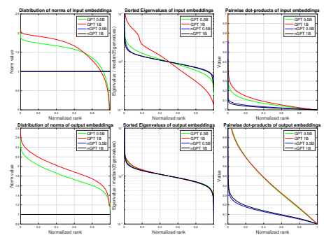
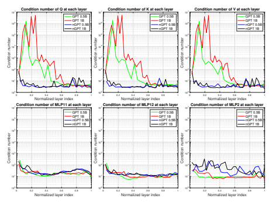
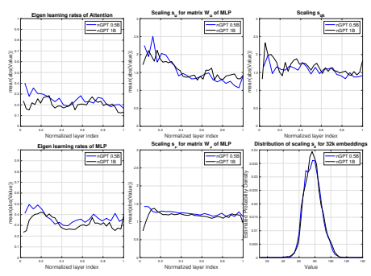
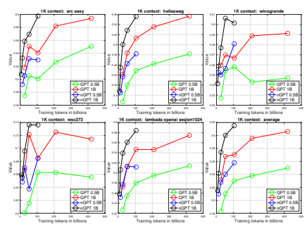
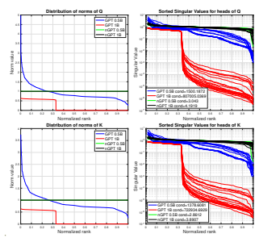

# nGPT: Normalizedtransformer Withrepre- Sentationlearning On Thehypersphere

Ilya Loshchilov, Cheng-Ping Hsieh, Simeng Sun & Boris Ginsburg NVIDIA 
{iloshchilov,chsieh,simengs,bginsburg}@nvidia.com

### Abstract

We propose a novel neural network architecture, the normalized Transformer (nGPT) with representation learning on the hypersphere. In nGPT, all vectors forming the embeddings, MLP, attention matrices and hidden states are unit norm normalized. The input stream of tokens travels on the surface of a hypersphere, with each layer contributing a displacement towards the target output predictions. These displacements are defined by the MLP and attention blocks, whose vector components also reside on the same hypersphere. Experiments show that nGPT learns much faster, reducing the number of training steps required to achieve the same accuracy by a factor of 4 to 20, depending on the sequence length.

### 1 Introduction

The Transformer architecture (Vaswani et al., 2017) is the foundation for most of modern language models. An enormous number of modifications to this architecture have been proposed to improve training stability, inference costs, context length, robustness, etc. It has been noted that the application of various normalization techniques is beneficial (Salimans & Kingma, 2016), leading to experiments with adding normalization layers such as LayerNorm and RMSNorm in nearly every possible position within the network (Xiong et al., 2020). Another approach to the model normalization is through controlling the norm of weights using weight decay (Loshchilov & Hutter, 2019). Recent studies (Andriushchenko et al., 2023) suggest reevaluating the role of weight decay and taking a closer look at rotations rather than focusing solely on vector norms (Kodryan et al., 2022; Kosson et al., 2023). Franke et al. (2023) suggested to enforce an upper bound onL2 norm of parameter groups. There is growing evidence that representation learning on the hypersphere is associated with more stable training, greater embedding space separability, and better performance on downstream tasks (Wang & Isola, 2020). Recent studies also suggest that transformers implicitly perform gradient descent as meta-optimizers (Von Oswald et al., 2023; Dai et al., 2022). We propose to unify various findings and observations made in the field under a new perspective of the normalized Transformer. Our key contributions are as follows:
Optimization of network parameters on the hypersphere We propose to normalize all vectors forming the embedding dimensions of network matrices to lie on a unit norm hypersphere. This allows us to view matrix-vector multiplications as dot products representing cosine similarities bounded in [-1,1]. The normalization renders weight decay unnecessary.

Normalized Transformer as a variable-metric optimizer on the hypersphere The normalized Transformer itself performs a multi-step optimization (two steps per layer) on a hypersphere, where each step of the attention and MLP updates is controlled by eigen learning rates—the diagonal elements of a learnable variable-metric matrix. For each tokentiin the input sequence, the optimization path of the normalized Transformer begins at a point on the hypersphere corresponding to its input embedding vector and moves to a point on the hypersphere that best predicts the embedding vector of the next tokenti+1.

Faster convergence We demonstrate that the normalized Transformer reduces the number of training steps required to achieve the same accuracy by a factor of 4 to 20. 

1

### 2 Evolution Of The Transformer: From Gpt To Ngpt

This section outlines the baseline Transformer and the modifications necessary to derive its normalized version. We illustrate these changes for Transformer decoder with self-attention only. The extension to encoder-decoder and cross-attention is straightforward. A summary of these changes is given in Table 1, with details in Section 2.6.

### 2.1 Token Embeddings And Output Logits

The decoder-only Transformer is trained to predict token ti using previous tokens input sequence x = (t1, t2**, . . . , t**i−1). For each input token ti, we retrieve its corresponding embedding in R
dmodel from a learnable embedding matrix Einput ∈ R
V ×dmodel with vocabulary of size V . Similarly, the target output sequence y is represented using a learnable embedding matrix Eoutput ∈ R
V ×dmodel.

Notably, since both Einput and Eoutput are learnable (unless they are tied to be equivalent), any token ti can have different embeddings in the input and output sequences. To measure token similarity during model training, the dot product between the corresponding embedding vectors is used. However, the norms of embedding vectors in the original Transformer are unconstrained, which can lead to inaccurate similarity estimation. To improve the accuracy of similarity estimation, we propose to normalize the embedding vectors stored in Einput and Eoutput after each step of the training algorithm.

The next token prediction is enforced by causal masking (see Section 2.3) to ensure that no future tokens are considered. This allows the model to compute the prediction error for all T tokens in parallel during training, while preserving the autoregressive nature of the task. After the Transformer processes the sequence (x1**, . . . ,** xi−1), it produces an output vector hi ∈ R
dmodel for each i-th position in the predicted sequence. The logits zi ∈ R
V, representing the unnormalized probabilities for each token in the vocabulary, are computed using the output embedding matrix Eoutput:

$$z_{i}=E_{\mathrm{output}}h_{i}$$
zi = Eoutputhi (1)
The logits zi are passed through a softmax function to convert them into probabilities:

$$P(y_{i}|\mathbf{x}_{1},\ldots,\mathbf{x}_{i-1})={\frac{\exp(z_{i,y_{i}})}{\sum_{v=1}^{V}\exp(z_{i,v})}}$$
$\left(1\right)$. 

$$(2)$$
$\eqref{eq:walpha}$. 
Here, zi,yiis the logit corresponding to the correct token yi, and the denominator normalizes the logits into a probability distribution over the vocabulary. During inference, the prediction yˆiis obtained by selecting the token with the highest probability. Since all nGPT embeddings are normalized, the logits z ∈ R
Vin equation 1 represent dot products bounded in the range [−1, 1]. This limits the confidence (temperature) of the probability distribution generated by the softmax in equation 2. To adjust this during training, we introduce a trainable scaling parameter sz ∈ R
Vthat scales the logits element-wise:

$$z\leftarrow\mathbf{z}\mathbf{s}_{z}$$
z ← zsz (3)

Table 1: Transformer vs. Normalized Transformer.

| Transformer                                                   | Normalized Transformer                                                                                                           |
|---------------------------------------------------------------|----------------------------------------------------------------------------------------------------------------------------------|
| ← hA  ATTN(RMSNorm(h))                                        | ← hA  Norm(ATTN(h))                                                                                                              |
| h ←  h + hA                                                   | h ← −  Norm(h + αA(hA  h))                                                                                                       |
| ← hM  MLP(RMSNorm(h))                                         | ← hM  Norm(MLP(h))                                                                                                               |
| h ←  h + hM                                                   | h ← −  Norm(h + αM(hM  h))                                                                                                       |
| Final: h ←  RMSNorm(h)                                        |                                                                                                                                  |
| All parameters of matrices and  embeddings are unconstrained. | After each batch pass, all matrices and embeddings are normalized  along their embedding dimension. The hidden state updates are |
|                                                               | controlled by learnable vectors of eigen learning rates αA  and αM.                                                              |

### 2.2 Layers And Blocks 2.2.1 Baseline Transformer

L layers of transformations are applied to the hidden state h, consisting of alternating the selfattention (ATTN) and multi-layer perceptron (MLP) blocks:

$\mathbf{h}\gets\mathbf{h}+\text{ATTN}(\text{RMSNorm}(\mathbf{h}))$  $\mathbf{h}\gets\mathbf{h}+\text{MLP}(\text{RMSNorm}(\mathbf{h}))$, (1)
$$\begin{array}{l}{(4)}\\ {(5)}\end{array}$$
where RMSNorm(h) is one of several possible normalizations. It is used first to normalize each embedding to a norm of √dmodel, then scales each dimension by a learnable vector of dmodel factors, typically initialized to 1. Since the transformation block outputs are added to h, the token embedding norms can vary significantly. To address this, normalization is also applied after the final layer.

  **Acknowledgments**  I would like to thank my supervisor, for his kind of support. I would like to thank my supervisor, for his kind of support.  

### 2.2.2 Normalized Transformer

For any points a and b on the surface of a hypersphere in R
dmodel , SLERP (Spherical Linear Interpolation) by Shoemake (1985) computes an interpolation along the geodesic (shortest path):

$$\operatorname{SLERP}(\mathbf{a},\mathbf{b};\alpha)={\frac{\sin((1-\alpha)\theta)}{\sin(\theta)}}\mathbf{a}+{\frac{\sin(\alpha\theta)}{\sin(\theta)}}\mathbf{b}$$

where θ = arccos(a · b) is the angle between the points a and b, and α ∈ [0, 1] is the interpolation parameter, with α = 0 returning a and α = 1 returning b. Our experiments suggest that SLERP can be approximated by simple linear interpolation (LERP):

$$\operatorname{LERP}(\mathbf{a},\mathbf{b};w)=(1-\alpha)\mathbf{a}+\alpha\mathbf{b}$$
LERP(a, b; w) = (1 − α)a + αb (7)
Let us rewrite this equation as an update equation in nGPT:

$$(\mathbf{6})$$
$$(T)$$

$$a\gets a+\alpha(b-a)$$
a ← a + α(b − a) (8)
where a is h, and, b is the point suggested by the attention or MLP block. Then, for the gradient g = a − b, a more general form involving a variable matrix B ∈ R
dmodel×dmodel becomes:

$\left(8\right)$. 
$$a\gets a-\alpha B g$$
$\eqref{eq:walpha}$. 
$$\begin{array}{l}{(10)}\\ {(11)}\end{array}$$
a ← a − αBg (9)
In quasi-Newton methods, B approximates the inverse Hessian matrix H−1.When B is diagonal with non-negative elements, αB becomes a vector α ∈ R
dmodel
≥0 whose elements correspond to the diagonal of B times the learning rate α. We denote α as **eigen** learning rates (from the German word eigen, meaning "own," referring to the internal structure of the Transformer). We provide some notes in Appendix A.2. Following equation 8, the update equations for the attention and MLP blocks are as follows:

$h\gets\text{Norm}(\,h+\alpha_{\text{A}}(h_{\text{A}}-h)\,)$  $h\gets\text{Norm}(\,h+\alpha_{\text{M}}(h_{\text{M}}-h)\,)$, (13.1)
where αA ∈ R
dmodel
≥0and αM ∈ R
dmodel
≥0are learnable parameters applied to the normalized outputs of the attention and MLP blocks hA = Norm(ATTN(h)) and hM = Norm(MLP(h)), respectively.

The function Norm(x) normalizes any vector x to have unit norm, and, unlike RMSNorm or LayerNorm, does not introduce any element-wise scaling factors. The normalization can be viewed as the retraction step in Riemannian optimization, mapping the updated solution back to the manifold. Appendix A.3 discusses the extension of our update equations in the context Riemannian optimization. In contrast to the baseline Transformer, no additional normalization is required after the final layer, as the embeddings are already normalized by the proposed scheme.

### 2.3 Self-Attention Block 2.3.1 Baseline Transformer

The attention mechanism is a key component of the Transformer. It allows each token to attend to every other token in the sequence, enabling the model to capture long-range dependencies. The block typically starts with a normalization of the input hidden state h using RMSNorm to deal with fluctuating norms of embeddings. Then, the normalized h is projected into three separate vectors - the query q, the key k, and the value v:

$$q\gets h W_{q},k\gets h W_{k},v\gets h W_{v}$$
$$(12)^{\frac{1}{2}}$$
$$(13)$$
q ← hWq, k ← hWk, v ← hWv (12)
where Wq,Wk,Wv ∈ R
dmodel×dk are learned projection matrices, and dk is the dimensionality of the query/key vectors. To incorporate positional information, we apply Rotary Position Embeddings (RoPE) by Su et al. (2024) to both the query and key vectors. The attention scores are computed by taking the dot product of the query and key vectors, scaling them by √
1 dk
, then applying a softmax function to obtain attention weights, and finally computing a weighted sum of the value vectors v:

$$\mathrm{Attention}(\mathbf{q},\mathbf{k},\mathbf{v})\leftarrow\mathrm{softmax}\left({\frac{\mathbf{q}\mathbf{k}^{\top}}{\sqrt{d_{k}}}}+\mathbf{M}\right)\mathbf{v},$$
v, (13)
where M is a matrix that prevents attending to future tokens by setting the corresponding entries to
−∞. Specifically, Mi,j = 0 if j ≤ i and Mi,j = −∞ if **j > i**.

In practice, nheads attention heads are used where for each i-th head, separate linear projections Wiq,Wi k,Wi vare applied, and the attention mechanism is computed independently for each head:

$$h_{\mathrm{A}}\leftarrow\mathrm{Concat}(\mathrm{head}_{1},\ldots,\mathrm{head}_{n_{\mathrm{heads}}})W_{o}$$
$$(14)$$

hA ← Concat(head1**, . . . ,** headnheads )Wo (14)
where headi = Attention(q i, k i, v i) and WO ∈ R
nheads×dk×dmodel is a learned projection matrix, where dk is typically set to dmodel/nheads.

### 2.3.2 Normalized Transformer

The matrix-vector multiplication of Wq ∈ R
dmodel×dk of the i-th head1and h ∈ R
dmodel can be viewed as a dot product between the columns of Wq and h. In the baseline Transformer, all matrices, including Wq are unconstrained, leading to unbounded values in q. We propose to normalize Wq, Wk, Wv and Wo along their embedding dimension so that the computed dot products with h can be interpreted as cosine similarity between unit norm vectors bounded in [−1, 1]. Thus, all attention matrices can be viewed as collections of normalized embedding vectors to be compared with. While each element of q and k is now bounded, the norms of these two vectors can still vary. Moreover, injection of positional information by RoPE further distorts q and k. We propose to additionally normalize q and k, ensuring that the dot product of every query and key is under control:

$$\begin{array}{l}{{q\leftarrow\mathrm{Norm}(q)s_{q k}}}\\ {{k\leftarrow\mathrm{Norm}(k)s_{q k},}}\end{array}$$
$$\begin{array}{l}{(15)}\\ {(16)}\end{array}$$
k ← Norm(k)sqk, (16)
where sqk ∈ R
dkis a vector2 of trainable scaling factors for the i-th head.

In the original Transformer, the softmax scaling factor 1/
√dk in equation 13 is introduced to account for the expected variance of dk in the dot product of non-normalized query and key vectors. In the normalized Transformer, the expected variance of the dot product between normalized query and key vectors is 1/dk. To restore a variance of 1, the softmax scaling factor should instead be √dk. If the softmax scaling factor is set to 1, this is equivalent to initializing the scaling factors sqk at d 1/4 k.

### 2.4 Mlp Block 2.4.1 Baseline Transformer

The input hidden state h of the MLP block is first normalized using RMSNorm and then passed through two separate linear projections, producing two intermediate vectors (we omit bias terms):

$$u\gets h W_{u},\quad\nu$$
$$\nu\longleftarrow h W_{\nu}$$
u ← hWu, ν ← hWν (17)
1All the following equations are defined per head but we omit i-th head index for the sake of readability.

2There is no need for separate scaling factors for q and k as the scaling would simply be applied elementwise when computing the dot product between q and k.
$\eqref{eq:walpha}$
where Wu,Wν ∈ R
dmodel×dMLP are the learned weight matrices. The intermediate vectors u and ν are combined using a gated activation function called SwiGLU defined by Shazeer (2020) as:

$$\operatorname{SwiGLU}(\mathbf{u},\nu)\gets\mathbf{u}\cdot\operatorname{SiLU}(\nu)$$
$\downarrow$ . 
SwiGLU(u, ν) ← u · SiLU(ν) (18)
where SiLU(ν) = ν · σ(ν), and σ(ν) is the sigmoid function. The result of the gated activation is then passed through a final linear transformation WoMLP ∈ R
dMLP×dmodel :

$\mathsf{MLEP}$. 
hM ← SwiGLU(u, ν)WoMLP (19)

### 2.4.2 Normalized Transformer

We propose to normalize matrices Wu and Wν along the embedding dimension so that the u and ν vectors represent the cosine similarity between h and vectors stored in Wu and Wν, respectively.

To control their impact, we introduce scaling factors su ∈ R
dMLP and sν ∈ R
dMLP :

$$(19)$$
$\mathbfit{u}\gets\mathbfit{us}_{u}$,  $\mathbfit{\nu}\gets\mathbfit{\nu}\mathbfit{s}_{\nu}\sqrt{d_{model}}$, (13.1)
$$(20)$$
$\eqref{eq:walpha}$
where the rescaling of ν by √d**model** is needed to benefit from the non-linearity of SiLU (see the Appendix A.1). The output of the MLP block is invariant to rescaling of u by a scalar.

### 2.5 Effective Learning Rates In Adam

The core of the Adam algorithm by Kingma (2014) is as follows:

$\mathbf{m}\gets\beta_{1}\mathbf{m}+(1-\beta_{1})\mathbf{g}$  $\mathbf{v}\gets\beta_{2}\mathbf{v}+(1-\beta_{2})\mathbf{g}^{2}$  $\mathbf{\theta}\gets\mathbf{\theta}-\alpha\mathbf{m}/(\sqrt{\mathbf{v}}+\epsilon)$,
$\eqref{eq:walpha}$. 
where θ is the parameter vector, g is the batch gradient, m is the momentum, v is the estimate of the per-element gradient amplitudes, α is the scheduled learning rate, ǫ is a small constant, and β1 < β2 are momentum factors close to 1. We cite the text of the original Adam paper using our notation: *In more common scenarios, we will have that* √mv ≈ ±1 *since*
E[g]/pE[g 2]
 ≤ 1. The effective magnitude of the steps taken in parameter space at each timestep is approximately bounded by the stepsize setting α. Thus, α controls the effective step-size in the search space, while the ratio
√mv can temporarily increase (respectively, decrease) the step-size if the current amplitude of perparameter momentum is greater (respectively, smaller) than its estimated value over longer time horizon. Consider an example where θi = 0.01 and the global learning rate is 0.001. If the gradient amplitude remains stable (i.e., √mi vi
≈ 1), it would take 0.02−0.01 0.001 = 10 steps to double θi. However, if θi = 1.0, it would take 2.0−1.0 0.001 = 1000 steps to double. Even if the gradient's amplitude is larger in the second case, the number of steps would only decrease if mi >
√v.

In nGPT, for any trainable vector of scaling parameters such as sa, we use two scalars s**a,init** and s**a,scale**. When initializing sa as a trainable parameter, its initial value is set to s**a,scale**. However, during the forward pass we restore its actual value by multiplying sa,init/s**a,scale**. This allows us to control the effective learning rate for sa by adjusting s**a,scale**, while keeping the global learning rate unchanged. For example, setting s**a,init** = 1 and s**a,scale** = 1/
√d**model** ensures that this parameter is updated with the same effective learning rate as other normalized parameters in the network.

### 2.6 Summary Of Modifications

The recipe to convert the baseline Transformer into the normalized Transformer is as follows:
1. Remove all normalization layers such as RMSNorm or LayerNorm. 2. After each training step, normalize all matrices (Einput, Eoutput, Wq, Wk, Wv, Wo, Wu, Wν and WoMLP) along their embedding dimension.

3. Replace the update equations 4 and 5 by equations 10 and 11, where αA (and also αM) is treated with αA**,init** = 0.05 (in order of 1/n**layers**) and αA**,scale** = 1/
√d**model**.

4. Change the softmax scaling factor in attention from 1/
√dk to √dk. Implement the rescaling and normalization (normalization here is optional) of q and k as in equations 15 and 16, where sqk is treated with s**qk,init** = 1 and s**qk,scale** = 1/
√d**model**.

5. Implement the rescaling of the intermediate state of the MLP block using equations 20 and 21, where su (and also sν) is treated with s**u,init** = 1 and s**u,scale** = 1 6. Implement the rescaling of logits using equation 3, where sz is treated with s**z,init** = 1 and s**z,scale** = 1/
√d**model**.

7. Remove weight decay and learning rate warmup.

### 3 Experiments

We train both the baseline Transformer (GPT) and the normalized Transformer (nGPT) on the Open- WebText dataset (Gokaslan & Cohen, 2019) and evaluate them on a set of standard downstream tasks. We experiment with models containing 0.5B and 1B parameters, including the embeddings. For both GPT and nGPT, we report results using the best initial learning rate settings (see Appendix A.6). A detailed description of the setup and hyperparameters is in Appendix A.5.

3.1 ACCELERATION OF TRAINING

Figure 1 presents the validation loss during the training of GPT and nGPT models with 1 billion parameters and a sample length of 4k tokens. After 20k iterations, nGPT achieves the same validation loss that GPT reaches only after 200k iterations (approximately 400 billion tokens), demonstrating a 10x speedup in terms of iterations and tokens used.3

Figure 2: Final validation loss (**y-axis**) for training runs with different computation budgets in tokens (**x-axis**). The training of 0.5B and 1B nGPT models is about 4x, 10x and 20x faster (in terms of

tokens) on 1k, 4k and 8k context lengths, respectively.

3While the time per step of nGPT is higher (80% - for 4k, and 60% - for 8k context respectively), it can be reduced after code optimization. Also the overhead is less significant for larger networks (see Appendix A.4).

Figure 3: Models trained with 4k context length. Final performance (**y-axis**) on a set of downstream tasks and their average value (**Bottom-Right**) for different computation budgets in tokens (**x-axis**).

Figure 2 illustrates how the performance gap between nGPT and GPT scales across three axes: total token budget, context length, and network size. Training the 0.5B and 1B nGPT models is approximately 4x, 10x, and 20x faster at context lengths of 1k, 4k, and 8k tokens, respectively. Figure 3 shows a similar pattern across downstream tasks, confirming that the acceleration is not only reflected in perplexity but also in task performance. Figures 8 and 9 in the Appendix provide results for 1k and 8k context lengths. We observe some saturation for the longest runs of nGPT, suggesting that the model capacity is nearly reached for this number of trainable model parameters.

### 3.2 Inspection Of Network Parameters

Figure 4 shows that, while nGPT maintains a fixed norm for embeddings (by design), GPT exhibits significant variation. The distribution of eigenvalues, computed from the covariance matrix of embeddings and normalized by their median, reveals that GPT's input embeddings have a higher condition number, especially in the 1B model. The distribution of pairwise dot products between embeddings indicates that even in nGPT, embeddings are not uniformly distributed across the hypersphere (where the dot product would approach 0), but instead form clusters—possibly reflecting natural patterns in language data. Dot products in GPT tend to have higher values due to its embeddings forming a hyper-ellipsoid, as suggested by the spread of vector norms. The ill-conditioned nature of GPT's input embeddings could lead to computational issues involving these embeddings.

Figure 5 shows the median condition numbers (across heads) for attention and MLP matrices at different layer depths—24 layers for the 0.5B model and 36 layers for the 1B model. GPT models exhibit significantly higher condition numbers in their attention matrices compared to nGPT. A closer inspection of these matrices (the 3rd and 4th layers are in Figure 11 and Figure 12 of Appendix) suggests that they degenerate into lower-rank matrices, potentially reducing the learning capacity of these blocks. One could argue that the elevated condition numbers are influenced by the norms of the vectors in these matrices. Our post-training normalization of these matrices is depicted

Figure 4: **Left**: Distribution of norms of vectors from input (**Top line**) and output (**Bottom line**) embedding matrices. **Middle**: Distribution of eigenvalues divided by its median value. **Right**: Pairwise distribution of dot products between embeddings. Models are trained for 100k iterations.

Figure 5: Median condition numbers for attention and MLP matrices at different layer depth (24 and 36 layers for 0.5B and 1B models, respectively). Models are trained for 100k iterations.

by the dotted lines in Figure 10 of the Appendix. While the adjusted condition numbers are reduced, they remain higher than those for nGPT, indicating potential rank deficiency. The need for such normalization highlights one of the issues that nGPT is specifically designed to address.

An important contribution of this work is the decoupling of predictions made by the Attention and MLP blocks from their impact on the hidden state h. These contributions are controlled by the eigen learning rates αA and αM. Their interpretation is straightforward: if αA,i for an embedding dimension i ∈ R
dmodel is 0.2, then the update follows hi ← (1−0.2)hi + 0.2hA,i. Thus, they directly quantify the contribution of hA,i into h. Figure 6 shows the average absolute values of hA and hM
at each layer. Notably, the network learns to take only modest steps (20%-30%) in the direction suggested by hA and hM. The average magnitude of αA decreases from 0.25 in the 0.5B network (24 layers) to 0.20 in the 1B network (36 layers). Meanwhile, αM decreases from 0.37 to 0.32, possibly because MLP blocks have more parameters, making their suggestions more precise.

The scaling factors su, sν and sqk remain relatively stable across layers. The value of sν can be interpreted as a measure of the non-linearity of the SiLU function, which behaves like ReLU for large sν and approximates a linear unit for values near 0 (see also Appendix A.1). The distribution of sz is primarily characterized by its mean, which influences the temperature of the softmax during cross-entropy calculations. The introduced scaling factors sqk, su, sν and sz seem to compensate for the removal of magnitude information when normalizing matrices and embeddings.

### 3.3 Ablation Studies

Appendix A.8 summarizes numerous ablation experiments. An important finding is that having fixed
(non-learnable) values for sqk, su, sν and a single global learnable value for sz leads to only a slight degradation in accuracy. Therefore, our presented general case can be simplified and become easier to interpret. Appendix A.7 demonstrates that nGPT can handle longer contexts without requiring any modifications to RoPE.

### 4 Related Work

Wang & Isola (2020) provides a comprehensive overview of the arguments for representation learning on the hypersphere. Spherical representations are associated with more stable training in the latent space of variational autoencoders (Xu & Durrett, 2018) and in embeddings used for face verification (Wang et al., 2017). Notably, when embeddings are well clustered, they tend to be linearly separable from the rest of the embedding space (Wang & Isola, 2020). Mettes et al. (2019) demonstrated that classification and regression can be unified by placing prototype embeddings uniformly on a hypersphere, allowing for separation with large margins a priori. Wang & Isola (2020) found a strong empirical correlation between downstream task performance and both the alignment (closeness) and uniformity of embeddings on the hypersphere. Since all embeddings in nGPT lie on the hypersphere, any update that causes the hidden state h to deviate from the manifold is followed by a normalization step. This normalization can be interpreted as a retraction in the context of Riemannian optimization. One might attempt to approximate nGPT's update in GPT by applying RMSNorm both at the beginning and end of the block (Xiong et al., 2020). However, this approach does not guarantee a fixed norm for the hidden state, nor does it ensure that the recombination approximates SLERP or LERP. The normalization in equations 15 and 16 closely resembles the QK normalization by Henry et al. (2020). In nGPT, this process can be viewed as restoring q and k of the i-th head to a (dmodel/nheads)-
dimensional hypersphere after the projection of h by Wq and Wk, respectively. Since h and the embedding dimensions of Wq and Wk are already normalized, the norms of q and k are also comparable, making their normalization potentially unnecessary. We explored this scenario (i.e., omitting the normalization of q and k) in our ablation studies (see Appendix A.8), where the results showed only a slight degradation. The performance drop was comparable to the computational time savings per step. Therefore, removing the normalization of q and k in nGPT is a viable option.

### 5 Discussion And Conclusion

This work builds on numerous key findings and observations made in the field which directly (Wang & Isola, 2020; Xu & Durrett, 2018; Wang et al., 2017) and indirectly (Salimans & Kingma, 2016; Franke et al., 2023; Kodryan et al., 2022; Kosson et al., 2023) support representation learning on the hypersphere. One of our main contributions is the normalization of the embedding dimensions of all matrices, ensuring they reside on the same hypersphere. Crucially, we observed that such normalization alone would constrain the inputs of non-linear units, and, thus, the scaling factors for these units should be introduced. In line with recent studies suggesting that transformers implicitly perform gradient descent as metaoptimizers (Von Oswald et al., 2023; Dai et al., 2022), we explicitly demonstrate how this process occurs in the normalized Transformer: i) the transformation blocks provide gradient information, ii)
this information is multiplied by eigen learning rates to adjust the hidden state, and iii) the commonly used normalization can be interpreted as a retraction step in Riemannian optimization, projecting the point back onto the hypersphere. We believe we are the first to decouple the eigen learning rates from the rest of the network, recognizing them as trainable parameters that can be interpreted as the diagonal elements of a variable-metric matrix. In other words, the normalized Transformer functions as a variable-metric optimizer, searching for output solutions using data-driven gradient information estimated in its attention and MLP blocks. The spherical representation provides valuable insights into the internals of nGPT, enabling the collection and analysis of statistics about its normalized components. Most importantly, it allows for the application of mathematical techniques specifically designed for dealing with hyperspheres. We believe that the reported acceleration, by a factor from 4 to 20, is only the first step towards uncovering new algorithms and architectures that could emerge from nGPT. Future work should explore scaling nGPT to larger network sizes, real-world datasets, and a broader range of tasks. For instance, the extension of nGPT to encoder-decoder and hybrid architectures (Dao & Gu, 2024; De et al., 2024) is straightforward.

### References

Naman Agarwal, Nicolas Boumal, Brian Bullins, and Coralia Cartis. Adaptive regularization with cubics on manifolds. *Mathematical Programming*, 188, 2021.

Maksym Andriushchenko, Francesco D'Angelo, Aditya Varre, and Nicolas Flammarion. Why do we need weight decay in modern deep learning? *arXiv:2310.04415*, 2023.

Damai Dai, Yutao Sun, Li Dong, Yaru Hao, Shuming Ma, Zhifang Sui, and Furu Wei. Why can GPT learn in-context? Language models implicitly perform gradient descent as meta-optimizers. arXiv:2212.10559, 2022.

Tri Dao and Albert Gu. Transformers are SSMs: Generalized models and efficient algorithms through structured state space duality. *arXiv:2405.21060*, 2024.

Soham De, Samuel L Smith, Anushan Fernando, et al. Griffin: Mixing gated linear recurrences with local attention for efficient language models. *arXiv:2402.19427*, 2024.

J¨org K. H. Franke, Michael Hefenbrock, Gregor Koehler, and Frank Hutter. Constrained parameter regularization. *arXiv:2311.09058*, 2023.

Aaron Gokaslan and Vanya Cohen. OpenWebText corpus.

http://Skylion007.github.io/OpenWebTextCorpus, 2019.

Alex Henry, Prudhvi Raj Dachapally, Shubham Pawar, and Yuxuan Chen. Query-key normalization for Transformers. *arXiv:2010.04245*, 2020.

Andrej Karpathy. NanoGPT. https://github.com/karpathy/nanoGPT, 2023. Diederik P Kingma. Adam: A method for stochastic optimization. *arXiv:1412.6980*, 2014. Maxim Kodryan, Ekaterina Lobacheva, Maksim Nakhodnov, and Dmitry P Vetrov. Training scaleinvariant neural networks on the sphere can happen in three regimes. *NeurIPS*, 2022.

Atli Kosson, Bettina Messmer, and Martin Jaggi. Rotational equilibrium: How weight decay balances learning across neural networks. *arXiv:2305.17212*, 2023.

Ilya Loshchilov and Frank Hutter. Decoupled weight decay regularization. In *ICLR*, 2019. Pascal Mettes, Elise Van der Pol, and Cees Snoek. Hyperspherical prototype networks. *NeurIPS*,
2019.

Alec Radford, Jeffrey Wu, Rewon Child, David Luan, Dario Amodei, and Ilya Sutskever. Language models are unsupervised multitask learners. https://openai.com/, 2018.

Tim Salimans and Durk P Kingma. Weight normalization: A simple reparameterization to accelerate training of deep neural networks. *NeurIPS*, 2016.

Noam Shazeer. Gated linear units (glu). *arXiv:2002.05202*, 2020. Ken Shoemake. Animating rotation with quaternion curves. In *Proc. of the 12th annual conference* on Computer graphics and interactive techniques, 1985.

Jianlin Su, Murtadha Ahmed, Yu Lu, Shengfeng Pan, Wen Bo, and Yunfeng Liu. Roformer: Enhanced transformer with rotary position embedding. *Neurocomputing*, 2024.

Ashish Vaswani, Noam Shazeer, Niki Parmar, Jakob Uszkoreit, Llion Jones, Aidan N Gomez, Lukasz Kaiser, and Illia Polosukhin. Attention is all you need. In *NeurIPS*, 2017.

Johannes Von Oswald, Eyvind Niklasson, Ettore Randazzo, Jo˜ao Sacramento, Alexander Mordvintsev, Andrey Zhmoginov, and Max Vladymyrov. Transformers learn in-context by gradient descent. In *ICML*, 2023.

Feng Wang, Xiang Xiang, Jian Cheng, and Alan Loddon Yuille. Normface: L2 hypersphere embedding for face verification. In *Proc. of the 25th ACM nternational conference on Multimedia*, 2017.

Tongzhou Wang and Phillip Isola. Understanding contrastive representation learning through alignment and uniformity on the hypersphere. In *ICML*, 2020.

Ruibin Xiong, Yunchang Yang, Di He, Kai Zheng, et al. On layer normalization in the Transformer architecture. In *ICML*, 2020.

Jiacheng Xu and Greg Durrett. Spherical latent spaces for stable variational autoencoders.

arXiv:1808.10805, 2018.

$$(23)$$

### A Appendix

A.1 RESCALING IN THE MLP BLOCK OF THE NORMALIZED TRANSFORMER When computing SwiGLU using equation 18, each element x of the vector v is an input to SiLU:

$$\operatorname{SiLU}(x)=x\cdot\sigma(x)=x\cdot{\frac{1}{1+e^{-x}}},$$

where σ(x) is sigmoid. For x with large magnitude, SiLU(x) approximates ReLU(x): when x **→ −∞**, SiLU(x) → 0, and when x → ∞, SiLU(x) ≈ x. The minimum of SiLU(xmin) ≈ −0.278 is located at xmin ≈ −1.278. While the elements of v represent dot products of d**model**- dimensional vectors and are bounded in [−1, 1], their expected absolute value (when they are random) is E[| cos(θ)|] = 2π· √1 d**model**
≈ √
0.**7979**
d**model**
. Thus, we should rescale x by 
√d**model**, otherwise, for very small x, we end up with SiLU(x) ≈ x/2. An alternative view is to note that since the variance of each of the normalized vectors (h and a vector from Wv) is 1/d**model**, the variance of 1 (suitable for the sigmoid part of SiLU) can be restored by rescaling of x by 
√d**model**. Based on these two views, we rescale v by 
√d**model** to benefit from the non-linearity of SiLU.

### A.2 Eigen Learning Rates

In the main text of the paper, we defined eigen learning rates as positive (α ← |α| is used during the forward pass). However, when they are not constrained to be positive, we obtain experimental results which are the same (up to numerical difference). This surprising observation can be explained as follows. Both the attention and MLP blocks have transformation matrices at their outputs. When the search is unconstrained, it is sufficient for Adam to flip (select) the sign of the i-th row of the output transformation matrix Wo to change the sign of the corresponding i-th coordinate in hA. Thus, the transformation calculated as αAWo is the same as α′AW′o, where α′A,i = −αA,i and W′o,(i,:) = −Wo,(i,:). In other words, when unconstrained, we can arrive at exactly the same transformation by flipping the signs in both α and Wo, which cancel each other. For simplicity and clearer interpretation, we suggest constraining α to be positive in the main paper. There is, however, another interesting scenario when eigen learning rate could become negative. In quasi-Newton methods, B approximates the inverse Hessian matrix H−1 whose diagonal elements are positive values if the function is locally convex which is the assumption of the Newton method
(H needs to be positive definite). However, the diagonal of H−1can have negative values if the objective function is non-convex and has saddle points. While quasi-Newton methods like BFGS aim to ensure (e.g., via regularization) that B is positive-definite even on non-convex problem, some Riemannian optimization methods can exploit negative curvature of H−1(Agarwal et al., 2021).

When the diagonal of B is unconstrained, we perform a variable-metric step, acknowledging that the function may be non-convex locally. We did not mention this in the main paper because, as noted earlier, the results with both constrained and unconstrained α are essentially the same.

### A.3 Riemannian Optimization

If h − hA is viewed as the gradient g in the Euclidean space, then, aligning with the requirements of Riemannian optimization, the projection of g onto the tangent space of the hypersphere is

$$g_{\mathrm{proj}}\gets h(h^{T}h_{\mathrm{A}})-h_{\mathrm{A}}$$
T hA) − hA (24)
The projection is equivalent to g when the dot product h T hA is 1. Depending on the alignment between h and hA, the projected gradient varies between h−hA (when the vectors are aligned) and −hA (when the vectors are orthogonal). The Riemannian variable-metric update then reads as:

$\mathbf{h}\leftarrow\text{Norm}(\,\mathbf{h}-\mathbf{B}_{\text{A}}(\mathbf{h}(\mathbf{h}^{T}\mathbf{h}_{\text{A}})-\mathbf{h}_{\text{A}})\,)$  $\mathbf{h}\leftarrow\text{Norm}(\,\mathbf{h}-\mathbf{B}_{\text{M}}(\mathbf{h}(\mathbf{h}^{T}\mathbf{h}_{\text{M}})-\mathbf{h}_{\text{M}})\,)$
$$(24)$$
$$(25)$$
$$(26)$$

| Model Parameter                    | 0.5B Models   | 1.0B Models   |
|------------------------------------|---------------|---------------|
| Number of Layers (nlayers)         | 24            | 36            |
| Model Dimension (dmodel)           | 1024          | 1280          |
| Number of Attention Heads (nheads) | 16            | 20            |
| Key Dimension (dk)                 | dmodel/nheads | dmodel/nheads |
| MLP Dimension (dMLP)               | 4dmodel       | 4dmodel       |
| Parameters in GPT                  | 468.2M        | 1025.7M       |
| Parameters in nGPT                 | 468.4M        | 1026.1M       |

Table 2: Model Parameters for GPT and nGPT

| Optimization Parameter   | GPT               | nGPT                               |
|--------------------------|-------------------|------------------------------------|
| Optimizer                | AdamW             | Adam (AdamW with weight decay 0.0) |
| Weight Decay             | 0.1               | 0.0                                |
| Number of Warmup Steps   | 2000              | 0                                  |
| Learning Rate Schedule   | Cosine Annealing  | Cosine Annealing                   |
| Initial Learning Rate    | problem\-specific | problem\-specific                  |
| Final Learning Rate      | 0                 | 0                                  |

Table 3: Optimization Parameters for GPT and nGPT
The normalization by Norm can be viewed as the retraction step in Riemannian optimization, mapping the updated solution back to the manifold. Our experimental results suggest that the impact of h T hM is negligible. Therefore, all experiments in the paper are based on equations 10 and 11.

### A.4 Time Cost Per Step

The time cost per step for nGPT is approximately 80% higher with 4k context length, and 60% higher with 8k context length. This overhead is not only due to nGPT having 6 normalization steps (2 of them are applied for q and k) per layer instead of 2, but also because nGPT's normalizations are not yet fully optimized, unlike GPT, where normalization layers are fused with other operations. Training on larger networks is expected to further reduce this performance gap, as the number of layers (and thus the number of normalizations) increases only modestly with the number of network parameters. Appendix A.8 shows that we can remove the normalization of q and k with a minor negative impact on results.

### A.5 Experimental Setup

In all experiments, we use OpenWebText (Gokaslan & Cohen, 2019) dataset which, according to experiments of Karpathy (2023), represents a good approximation of the OpenAI's internal dataset used to train GPT-2 models. We are well aware that this dataset is not of the highest quality. However, we believe that it is suitable for academic research, and, should improve the comparability of our findings with other research papers. We trained our models using 64 A100 GPUs distributed across 8 nodes (8 GPUs per node). Global batch size is 512. We use the LLaMA-2 tokenizer with 32k tokens. We use the same setup for the 0.5B and 1.0B parameter models. All matrix parameters are initialized by sampling from a zero-mean normal distribution with a standard deviation of 0.02 for GPT and 1/
√dmodel for nGPT. The standard deviation for the output matrices was scaled by a factor of p2 × nlayer, as suggested by Radford et al. (2018). The initialization of matrix parameters is not important for nGPT because they are normalized afterwards. The base of RoPE is 10000. The initialization of the additional parameters introduced in nGPT is described in Section 2.6.

### A.6 Selection Of The Initial Learning

The initial learning rate is the only hyperparameter we tune for both GPT and nGPT. Figure 7 demonstrates our trials to select the most suitable initial learning rate for GPT and nGPT. Our first experiments started with the 0.5B model and 1k context length. After observing the general trend of these curves, we reduced the number of experiments and followed the trends to minimize the total compute used. Apart from estimating the optimal settings for the initial learning rate, our general observation is that the optimal learning rates for GPT and nGPT tend to be similar for the same values of the validation loss. Longer runs are usually associated with the possibility of achieving lower values of the validation loss, and this typically requires lower initial learning rates. One artifact we observed is the increasing sensitivity of the 1B nGPT model on 8k context length. We found that the smoothness of the hyperparameter curves can be restored (see the dotted lines with squares) by increasing αA,init and αM,init from their default value of 1/
√d**model** to 0.1. This change decreases the effective learning rate of Adam on these variables by a factor of(1/
√d**model**)/0.1 ≈ 3.

As a result, the eigen learning rates are learned by Adam at a slower rate.

Figure 7: Final validation loss values for different initial learning rates for the 0.5B models (Top) and 1B models (**Bottom**). GPT is denoted by solid lines with circles, while nGPT is represented by the dotted lines with stars. A specific case with a different setup, denoted by the dotted lines with squares (**Bottom Right**), is discussed in the text.

Figure 8: Models trained with 1k context length. Final performance (**y-axis**) on a set of downstream tasks and their average value (**Bottom-Right**) for different computation budgets in tokens (**x-axis**).

Figure 9: Models trained with 8k context length. Final performance (**y-axis**) on a set of downstream tasks and their average value (**Bottom-Right**) for different computation budgets in tokens (**x-axis**).

Figure 10: Median condition numbers measured for attention and MLP matrices at different layer depth (24 and 36 layers for 0.5B and 1B networks, respectively). The dotted lines are for the case when GPT's matrices are renormalized after training. Models are trained for 100k iterations.

Figure 11: **Left**: Distribution of the norms of vectors forming the complete attention matrices (not per head). **Right**: Distribution of singular values for all heads. The results are shown for the 3rd layer.

Figure 12: **Left**: Distribution of the norms of vectors forming the complete attention matrices (not per head). **Right**: Distribution of singular values for all heads. The results are shown for the 4th layer.

### A.7 Length Extrapolation Ability

We investigate the length extrapolation ability of nGPT by evaluating its perplexity on the PG19 dataset, as shown in Figure 13. In standard GPTs, perplexity tends to increase dramatically when tested on sequences longer than pre-training length. In contrast, nGPT maintains a stable perplexity range even at extrapolated lengths. This result demonstrates that nGPT can handle longer contexts without requiring any modifications to RoPE, providing a clear advantage over standard GPTs in terms of length extrapolation.

Figure 13: PG19 perplexity from 1K to 32K.

### A.8 Ablation Studies

We perform a series of ablations in nGPT, focusing on the selection of scaling factors sqk, su (sv), sz, as well as evaluating the necessity of normalization. For the scaling factors, we first examine the impact of different initializations of these parameters. Additionally, we explore whether these factors can be simplified to a learnable scalar or a fixed value. For normalization, we analyze whether the removal of QK-normalization is a feasible alternative. To ensure a fair comparison, all our ablation models have size 0.5B and context length 1k and are trained with learning rate 1 × 10−3for 100k iterations (∼52B tokens).

Table 4 presents various combinations of s**init** and s**scale** for each scaling factor, as well as the downstream task accuracy and validation loss. Additionally, we report the mean value of each scaling factor distribution to show the final converged scaling value after training. For sqk, we observe that the mean value (Mean(s)) is relatievly stable with value around 1 across most initialization settings, except when using smaller s**init** and larger s**scale**, which results in a Mean(s) value less than 1. For su and sv, changes in initialization lead to significant shifts in Mean(s), accompanied by increases in final validation loss. For sz, we see a substantial degradation in both accuracy and loss under certain initializations. Overall, these results suggest that the baseline hyperparameter settings are robust but additional tuning of su, sv, and sz could potentially further improve performance. In Table 5, we modify each learnable per-element vector of the scaling factors sqk, su (sv), sz, and the eigen learning rates αA, αM to a single learned scalar or a fixed value. This ablation helps us determine whether these tuning parameters can be simplified in nGPT. From the table, we observe that most changes result in only negligible degradation (≤ 0.3%) in validation loss, and some even lead to slight improvements in accuracy. Notably, replacing the per-element vector sqk with a single scalar has minimal impact on the mean value, while the mean value of su, sv, sz, αA, and αM show a slight increase. Furthermore, even when fixing sqk, su, and sv, the model still achieves comparable accuracy and validation loss to the baseline using the per-element vectors. In Table 6, we investigate the impact of removing certain normalization operations in nGPT to potentially reduce training time per step. We remove QK normalization by eliminating the normalization terms **Norm** in equations 15 and 16. The results show that this modification lead to similar accuracy and loss compared to the baseline, indicating that they are effective options for reducing computational overhead without compromising performance.

|         | sinit         | sscale        | Mean(s)     | Avg. Acc (%) ↑   | Valid. Loss ↓   |
|---------|---------------|---------------|-------------|------------------|-----------------|
| sqk     | 1             | √ dmodel 1/   | 1.51        | 54.44            | 2.252           |
| sqk     | 0.33          | √ dmodel 1/   | 1.36        | 54.67            | \-0.33%         |
| sqk     | 0.05          | √ dmodel 1/   | 1.01        | 53.69            | \-0.09%         |
| sqk     | 1             | 1             | 1.38        | 54.19            | \-0.09%         |
| sqk     | 0.33          | 1             | 1.11        | 54.89            | \-0.08%         |
| sqk     | 0.05          | 1             | 0.29        | 52.41            | +1.94%          |
| su & sv | 1             | 1             | 1.24 & 1.12 | 54.44            | 2.252           |
| su & sv | √ dmodel 1/   | 1             | 0.03 & 0.03 | 53.51            | +0.92%          |
| su & sv | 1             | √ dmodel 1/   | 2.75 & 11.2 | 53.90            | +0.05%          |
| su & sv | √ d 1/  model | √ d 1/  model | 0.40 & 0.25 | 54.39            | +0.48%          |
| sz      | 1             | √ dmodel 1/   | 60.8        | 54.44            | 2.252           |
| sz      | √ dmodel      | √ dmodel 1/   | 106.1       | 52.60            | +1.06%          |
| sz      | 1             | 1             | 23.6        | 52.71            | +3.12%          |
| sz      | √ dmodel      | 1             | 63.6        | 51.84            | +1.66%          |

Table 4: Ablations of s**init** and s**scale**. Our default setup is the first row of each section. **Mean(**s)
is the mean value of the learned distribution after training. **Avg. Acc** is the average accuracy of our selected five downstream tasks, **Valid. Loss** is the final validation loss, and we use d**model** = 1024.

Table 5: Ablations of replacing learnable per-element vector (scaling factors and eigen learning rate) with a single learned scalar or a fixed value. The number of the learned vector, learned scalar and

| sqk           | su & sv              | sz             | αA & αM              | Avg. Acc (%) ↑   | Valid. Loss ↓   |
|---------------|----------------------|----------------|----------------------|------------------|-----------------|
| vector = 1.47 | vector = 1.12 & 1.24 | vector = 60.80 | vector = 0.22 & 0.33 | 54.44            | 2.252           |
| scalar = 1.49 | vector = 1.13 & 1.23 | vector = 62.11 | vector = 0.22 & 0.33 | 54.05            | +0.22%          |
| vector = 1.46 | scalar = 1.46        | vector = 60.70 | vector = 0.22 & 0.33 | 54.23            | +0.07%          |
| vector = 1.47 | vector = 1.12 & 1.24 | scalar = 95.65 | vector = 0.22 & 0.33 | 53.69            | +0.20%          |
| vector = 1.40 | vector = 1.13 & 1.13 | vector = 60.90 | scalar = 0.30 & 0.36 | 54.86            | +0.22%          |
| scalar = 1.51 | scalar = 1.47        | vector = 61.18 | vector = 0.22 & 0.32 | 54.52            | +0.17%          |
| scalar = 1.52 | scalar = 1.68        | scalar = 96.65 | vector = 0.22 & 0.30 | 52.59            | +0.30%          |
| scalar = 1.49 | scalar = 1.17        | scalar = 88.64 | scalar = 0.30 & 0.37 | 53.61            | +0.62%          |
| value = 1.00  | vector = 1.12 & 1.15 | vector = 60.69 | vector = 0.24 & 0.35 | 54.17            | +0.11%          |
| vector = 1.45 | value = 1.00         | vector = 61.53 | vector = 0.23 & 0.35 | 55.51            | +0.05%          |
| value = 1.00  | value = 1.00         | vector = 61.26 | vector = 0.24 & 0.36 | 53.63            | +0.20%          |
| value = 1.00  | value = 1.00         | scalar = 96.15 | vector = 0.22 & 0.35 | 53.37            | +0.40%          |

fixed value are the mean values across all layers.

|                          | ARC\-E   | HellaSwag   | WinoGrande   | WSC273   | LAMBADA   | Avg. Acc (%) ↑   | Valid. Loss ↓   |
|--------------------------|----------|-------------|--------------|----------|-----------|------------------|-----------------|
| Baseline nGPT            | 53.07    | 46.03       | 55.96        | 67.03    | 50.13     | 54.44            | 2.252           |
| Baseline nGPT \- QK norm | 52.65    | 46.07       | 56.27        | 68.86    | 49.68     | 54.71            | +0.12%          |

Table 6: Ablations on the removal of QK normalization in nGPT which involves taking out the normalization terms **Norm** in equations 15 and 16.

19

### A.9 Analysis Of Scaling Parameters

In nGPT, we introduce a total six trainable parameters: the eigen learning rates αA and αM, along with the scaling factors sqk, su, sv and sz. Since these parameters are updated using gradients, we are interested in understanding their learned distributions after training. In Figure 14, we present the histograms of these saved weights combining across layers and analyze their distributions under different context lengths, model sizes, learning rates, and numbers of training tokens.

For αA and αM , we observe that their distributions remain stable across various learning rates.

However, increasing the context length or the number of training tokens tends to shift the distributions to the right, indicating that the hidden state h requires more transformation from the Attention and MLP blocks to handle the larger inputs. Additionally, the mean values for these parameters tend to be smaller in larger models because we have more layers to update the hidden state.

Regarding the scaling factors, sqk is quite stable under all the conditions, suggesting that a fixed value, similar to the softmax scaling factor in original transformer, may be sufficient. Interestingly, we find that sqk has a high density close to zero, indicating the sparsity of attention in nGPT. For su and sv, their distributions shift left as the context length increases, but shift right as the model size or the number of training tokens increases. Furthermore, these two factors become flatter when using larger learning rate. Lastly, for sz, we see higher mean values for longer context lengths, larger model sizes, and more training tokens, suggesting that the model may learn to use a lower temperature to make the final word distribution sharper.

Figure 14: The distribution of trainable eigen learning rates and scaling factors varies under different context lengths, model sizes, learning rates, and number of training tokens. If not specified, we use
context length 1K, model size 0.5B, learning rate 2.0 × 10−³, and traini
